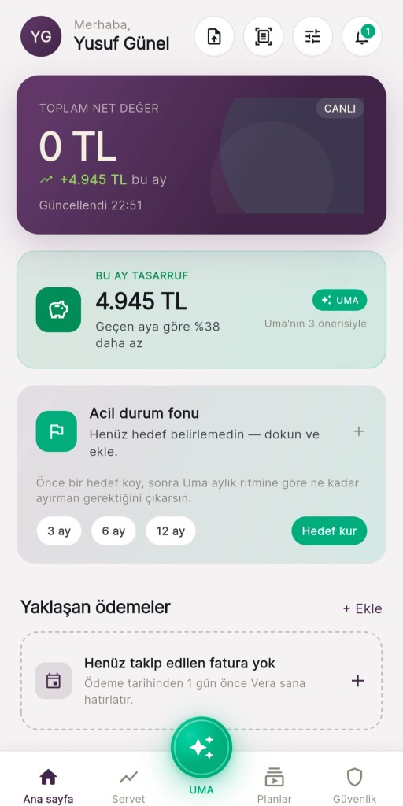
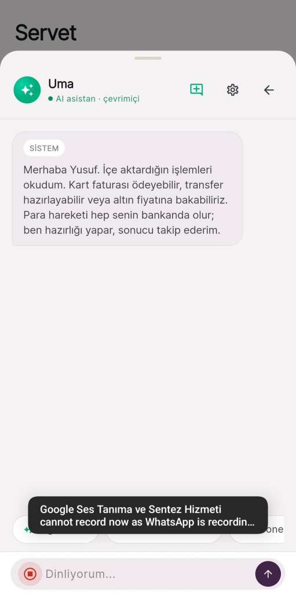
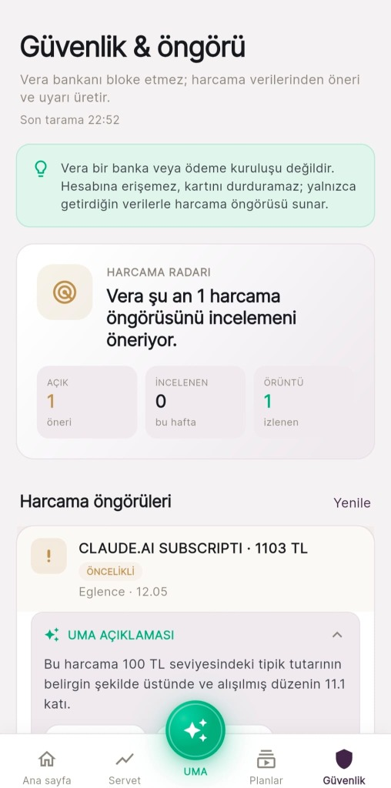
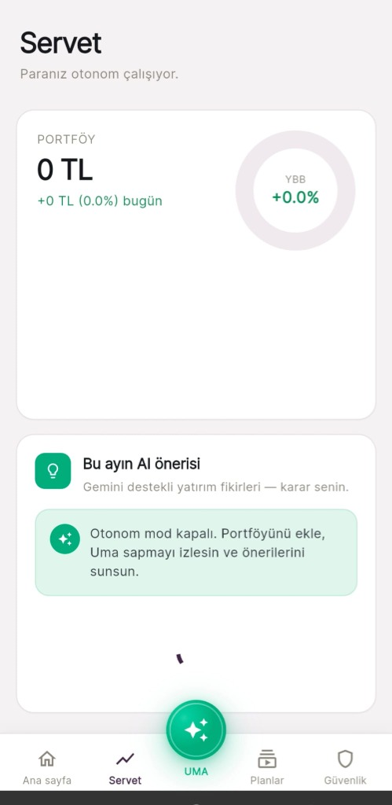
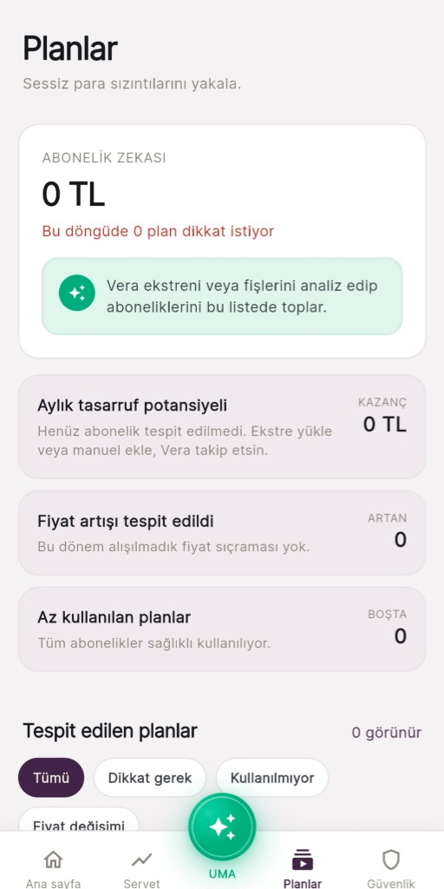
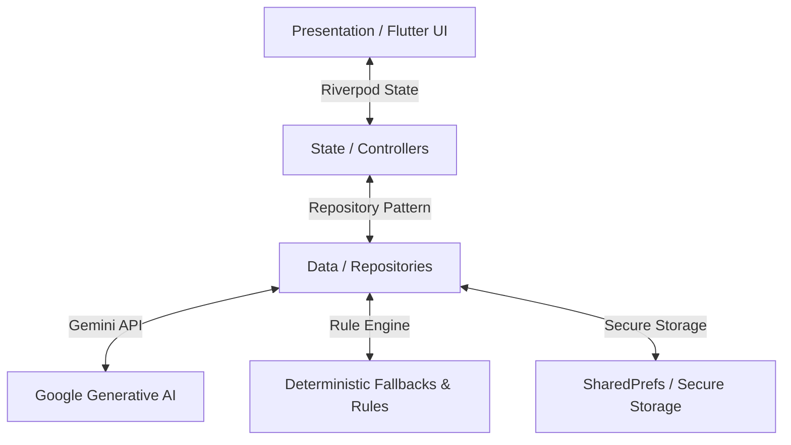

# <p align="center"><br>Vera</p>

<p align="center">
  <strong>BTK Hackathon için geliştirilen, yapay zeka yerel (AI-native) yeni nesil mobil finansal işletim sistemi prototipi.</strong>
</p>

<p align="center">
  
  
  
  
  
</p>

---

<p align="center">
  
</p>

---

## 🌟 Ürün Vaadi
> **"Vera bankaları bağlamıyor; siz veriyi getiriyorsunuz (PDF ekstre, fiş fotoğrafı, ekran görüntüsü, manuel giriş), Vera yapay zeka ile birleştirip anlamlandırıyor, doğru bankaya yönlendirip sonucu otonom takip ediyor."**
> 
> *Bu yenilikçi iş modeli sayesinde BDDK lisansına veya banka iş ortaklıklarına gerek kalmadan bugün çalışabilen, mevzuata tamamen uyumlu bir finansal asistan doğuyor!*

---

## 🚀 Hackathon Vizyonu: "AI-Native Financial OS"

Vera, sıradan bir "bankacılık arayüzü" veya basit bir chat bot değildir. Yapay zeka ile karar veren, açıklama üreten, risk algılayan, kullanıcıyı yönlendiren ve kontrollü şekilde aksiyon alabilen 6 farklı AI katmanının senkronize çalıştığı bütünsel bir **Finansal İşletim Sistemi**dir:

1. 🏦 **Open Banking Intelligence**: PDF/Excel ekstrelerinden veya manuel girdilerden harcama analizleri, otomatik kategorilendirme ve finansal özetler çıkarır.
2. 🚨 **Fraud Radar**: Şüpheli işlemleri yakalar. Açıklanabilir (explainable) kurallar çerçevesinde kullanıcıyı uyarır ve geri bildirimi ile kendini geliştirir.
3. 📊 **AI Credit Decisioning**: Gelişmiş kural motoru ve Gemini açıklamaları ile kredi başvurularını değerlendirir, reddedilen durumlar için alternatif yol haritaları sunar.
4. 🧠 **Autonomous Wealth Coach**: Kullanıcı varlıklarını analiz ederek kişiye özel portföy önerileri geliştirir ve otonom rebalancing tavsiyeleri sunar.
5. 💸 **Subscription Intelligence**: Kullanıcı harcamalarındaki sessiz para kaçışlarını (unutulan abonelikler, gizli fiyat artışları) tespit eder.
6. 🗣️ **Uma Agent Orchestration**: Doğal dil komutlarıyla çalışan finansal yardımcı. Güven skorları, kaynak referansları ve otonom araç tetikleyicileri ile tüm modülleri yönetir.

---

## 🎨 Arayüz & Görsel Deneyim

Vera, modern mobil tasarım trendlerini en üst seviyede uygulayarak sade, premium ve kullanışlı bir görsel deneyim sunar.

### 📱 Uygulama Ekran Görüntüleri

| 🏠 Ana Sayfa | 💬 UMA AI Asistanı | 🛡️ Güvenlik & Öngörü |
| :---: | :---: | :---: |
|  |  |  |

| 📈 Servet (Wealth) | 📅 Planlar (Abonelikler) |
| :---: | :---: |
|  |  |

### 🛠️ Gelişmiş Kişiselleştirme & Tema Motoru
Uygulama, kullanıcının ruh haline ve tarzına göre anında değişebilen **24 farklı görsel kombinasyon** sunar:
- **4 Renk Paleti**: Emerald Green, Deep Orchid, Sapphire Neon, Sunset Gold
- **2 Görsel Mod (Mood)**: Cyberpunk (Canlı neon), Velvet Dark (Mat & Premium)
- **3 Arayüz Hissi (Vibe)**: Rounded (Yumuşak köşeler), Sharp (Köşeli / Tech), Glass (Cam efekti)

---

## 🔑 Öne Çıkan Çalışan Özellikler

- **📁 Masaüstü/Web Sürükle-Bırak Entegrasyonu**: Ekstre ve fiş yükleme ekranlarında sürükle-bırak (`desktop_drop`) desteği ile masaüstü veya web ortamlarında hızlı dosya okuma.
- **📄 Akıllı OCR (Fiş & Ekstre PDF İçe Aktarma)**: `image_picker` ve `file_picker` ile yüklenen belgeleri Gemini çok modlu (multimodal) yapay zekasıyla anında ayrıştırma ve işlemleri otomatik oluşturma.
- **💬 Gelişmiş UMA Asistanı (v2)**: 
  - Kararların arkasındaki güven oranlarını gösteren *Confidence Label*
  - Bilginin kaynağını gösteren *Source Chips*
  - İşlem öncesi onay isteyen *Confirmation-first* aksiyon kartları
- **📅 Abonelik Detektörü**: Tekrarlanan ödemeleri otomatik saptama, dondurma veya Uma'ya yönlendirme.
- **📈 Kredi Simülatörü**: 4 farklı slider ile esnek vade ve tutar simülasyonu, risk analizi ve alternatif teklifler.
- **🛡️ Fraud Önleme**: `FraudHeuristic` altyapısı ile olağandışı transferleri (büyük miktarlar, ani artışlar vb.) tespit etme ve kullanıcı dönütleriyle modeli eğitme.
- **🌍 6 Dil & RTL Desteği**: Türkçe, İngilizce, Almanca, Arapça (RTL), Rusça ve Çince dilleriyle entegre yerelleştirme yapısı.
- **🔐 Firebase Auth & Yerel Fallback**: Güvenli e-posta girişi ve tüm yerel önbelleği temizleyen oturum kapatma akışı.

---

## 🏗️ Teknik Mimari

Proje, genişleyebilirliği ve paralel geliştirmeyi desteklemek amacıyla **Feature-First** (Özellik Öncelikli) ve **AI Module Boundaries** prensipleriyle tasarlanmıştır.

### Mimari Akış


### Klasör Yapısı
```text
lib/
├── main.dart           # Uygulama başlangıç noktası
├── app.dart            # Tema, yönlendirme ve lokalizasyon yapılandırmaları
├── core/
│   ├── config/         # Çevresel değişkenler (.env) ve özellik bayrakları
│   ├── routing/        # GoRouter navigasyon ve Shell yapısı
│   ├── services/       # Gemini API entegrasyonu (GeminiService)
│   ├── theme/          # Dinamik temalar, tasarım belirteçleri (Design Tokens)
│   └── utils/          # Biçimlendiriciler ve yardımcı sınıflar
├── shared/
│   └── widgets/        # Sürükle-Bırak (DragDropZone) ve ortak UI bileşenleri
└── features/
    ├── home/           # Dashboard, net değer geçmişi ve Gemini içgörü şeridi
    ├── wealth/         # Varlık yönetimi ve otonom portföy önerileri
    ├── credit/         # Kredi skorlama, risk faktörleri ve simülatör
    ├── security/       # Fraud tespiti, açıklanabilir kısıtlar ve geri bildirim
    ├── subscriptions/  # Abonelik tespiti ve kaçak harcama analizleri
    ├── uma_chat/       # Uma asistan, otonom araçlar ve güven katmanı
    └── profile_settings/# 24 farklı tema kombinasyonu ve profil yönetimi
```

---

## 🛠️ Kullanılan Teknoloji Yığını (Stack)

* **Çatı**: Flutter **3.24+** / Dart **3.5+**
* **Durum Yönetimi**: `flutter_riverpod` (Repository, Service ve UI arası temiz veri akışı)
* **Yönlendirme**: `go_router` (Deklaratif navigasyon)
* **Yapay Zeka**: `google_generative_ai` (Gemini SDK entegrasyonu)
* **Dosya Girişleri & OCR**: `image_picker`, `file_picker` ve `desktop_drop` (Masaüstü ve Web sürükle-bırak desteği)
* **Yerel Depolama**: `shared_preferences` + `flutter_secure_storage` (Şifrelenmiş hassas anahtar deposu)
* **Güvenlik & Arka Plan**: Firebase Auth, Cloud Firestore, Firebase Storage ve `flutter_local_notifications`

---

## 💻 Kurulum ve Hızlı Başlangıç

### Ön Gereksinimler
* Bilgisayarınızda Flutter SDK kurulu olmalıdır (`flutter doctor` ile doğrulayabilirsiniz).

### Adımlar
1. Projeyi bilgisayarınıza klonlayın ve klasöre gidin:
   ```bash
   git clone https://github.com/yusufgunel/vera-bu.git
   cd vera-bu
   ```
2. Bağımlılıkları yükleyin:
   ```bash
   flutter pub get
   ```
3. Kök dizindeki `.env.example` dosyasını kopyalayarak `.env` adında yeni bir dosya oluşturun:
   ```bash
   cp .env.example .env
   ```
4. `.env` dosyası içindeki `GEMINI_API_KEY` alanına kendi Gemini API anahtarınızı girin:
   ```text
   GEMINI_API_KEY=AIzaSy...
   ```
5. Uygulamayı çalıştırın:
   ```bash
   flutter run
   ```

---

## 🎬 90 Saniyelik Demo Hikayesi
Sahnede veya jüri önünde Vera'yı en hızlı şekilde anlatacak akış:

1. **Finansal Kokpit (Home)**: Kullanıcı uygulamaya girer ve net varlığını, trend çizgisini ve Gemini tarafından üretilmiş proaktif harcama analizini görür.
2. **Sessiz Kaçaklar (Subscriptions)**: Abonelikler sayfasına geçilir. Yapay zeka, fiyatı artmış veya kullanılmayan abonelikleri kırmızı alarm ile gösterir.
3. **Güvenlik Çemberi (Security)**: Şüpheli bir işlem (fraud) simüle edilir. `FraudHeuristic` ile sistemin neden bloke koyduğunu açıklayan AI kartı gösterilir ve kullanıcı geri bildirimi tetiklenir.
4. **Otonom Varlık Planlama (Wealth)**: Birikim hedeflerine yönelik AI tabanlı portföy rebalancing önerisi incelenir.
5. **Kredi Kılavuzu (Credit)**: Kredi skor simülatörüyle oynanır; AI başvuruyu reddederse "Kredi skoru neden düşük?" ve "Bunu düzeltmek için ne yapmalısınız?" gibi açıklayıcı çıktılar izlenir.
6. **Uma Co-pilot**: Uma asistanına "Aylık mutfak masrafımı %10 kısmama yardım et" denir ve asistan otonom bir şekilde tasarruf planı oluşturur.

---

## 📋 Proje Belgeleri Matrixi

| Belge | İçerik ve Detaylar |
|---|---|
| 🎯 [Ürün Vizyonu](docs/URUN_VIZYONU.md) | Ürün konumlandırma, persona tanımları ve başarı metrikleri |
| 🏗️ [Mimari Tasarım](docs/MIMARI.md) | Feature-first Flutter yapısı, AI modül sınırları ve kodlama kuralları |
| 🧠 [Yapay Zeka Promptları](docs/PROMPTS.md) | Vera içinde kullanılan gerçek Gemini prompt şablonları |
| 🎬 [Demo Senaryosu](docs/DEMO_SCRIPT.md) | 3 dakikalik detaylı sahne sunumu adımları |
| ⚙️ [Geliştirici Kurulumu](docs/SETUP.md) | Detaylı geliştirici ortamı yapılandırması |
| 🌐 [Canlı Yayın & Dağıtım](docs/DEPLOY.md) | Web yayını ve release checklist adımları |
| ☁️ [Firebase Yapılandırması](docs/FIREBASE_SETUP.md) | Firestore, Storage ve App Check servisleri kurulum rehberi |
| 📝 [Geliştirme Notları](docs/HACKATHON_NOTLARI.md) | BTK Hackathon'26 kapsam analizi ve yapılacaklar listesi |

---

## ⚖️ Lisans & Mevzuat Matrisi

Finans teknolojilerinde en büyük bariyer olan BDDK ve lisanslama süreçleri, Vera'nın **veriyi getirme** iş modeli sayesinde tamamen aşılmıştır:

| Yetenek | Lisans Gerekir mi? | Vera Bunu Yapabilir mi? | Mevzuat Durumu |
|---|---|---|---|
| **Ekstre PDF Okuma** | ❌ Hayır | ✅ Evet | Tamamen yasal (Kullanıcı rızasıyla veri yükleme) |
| **Fiş Görseli OCR** | ❌ Hayır | ✅ Evet | Tamamen yasal (Kullanıcı rızasıyla veri yükleme) |
| **AI Harcama Analizi** | ❌ Hayır | ✅ Evet | Tamamen yasal (Yerel işleme ve AI analizi) |
| **Kredi Simülasyonu** | ❌ Hayır | ✅ Evet | Tamamen yasal (Eğitimsel ve simülatif analiz) |
| **Banka Uygulamasına Deep-link** | ❌ Hayır | ✅ Evet | Lisans gerektirmez, doğrudan yönlendirir |
| **Gerçek Zamanlı Bakiye Sorgulama** | ✅ Evet (AISP) | ❌ Hayır (Simüle) | Gelecekte banka ortaklığı ile entegre edilebilir |
| **Banka Adına Para Gönderme** | ✅ Evet (PISP) | ❌ Hayır (Yönlendirir) | Finansal transferler banka uygulamalarında tamamlanır |

---
*Vera, BTK Hackathon için tutkuyla geliştirilmiştir.* 🚀
